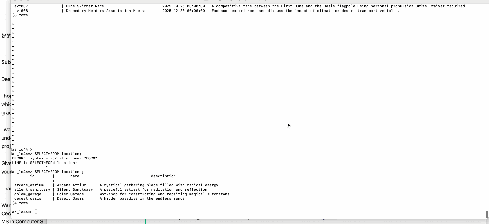
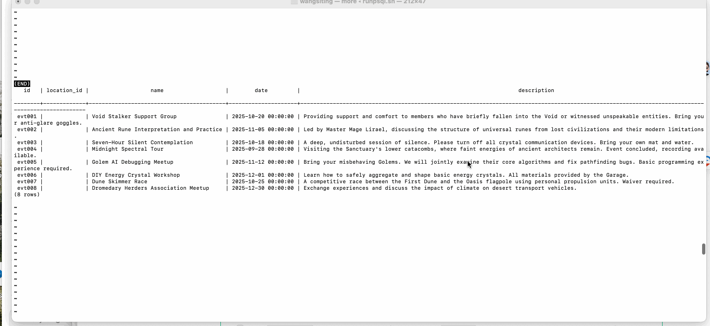

# WEB103 Project 3 - _UnityGrid Plaza_

Submitted by: **Your Name**

About this web app: **UnityGrid Plaza is an interactive virtual community space that allows users to explore events by location. The application features a visual SVG map interface where users can click on different locations to view events happening at each venue. Events display countdown timers and appear with different formatting when they have passed.**

Time spent: **X** hours

## Required Features

The following **required** functionality is completed:

<!-- Make sure to check off completed functionality below -->

- [x] **The web app uses React to display data from the API**
- [x] **The web app is connected to a PostgreSQL database, with an appropriately structured Events table**
  - [x] **NOTE: Your walkthrough added to the README must include a view of your Render dashboard demonstrating that your Postgres database is available**
  - [x] **NOTE: Your walkthrough added to the README must include a demonstration of your table contents. Use the psql command 'SELECT \* FROM tablename;' to display your table contents.**
- [x] **The web app displays a title.**
- [x] **Website includes a visual interface that allows users to select a location they would like to view.**
  - [x] _Interactive SVG map with clickable venue polygons and hover effects_
- [x] **Each location has a detail page with its own unique URL.**
- [x] **Clicking on a location navigates to its corresponding detail page and displays list of all events from the `events` table associated with that location.**

The following **optional** features are implemented:

- [x] An additional page shows all possible events
  - [x] Users can sort _or_ filter events by location via dropdown menu.
- [x] Events display a countdown showing the time remaining before that event
  - [x] Events appear with different formatting when the event has passed (grayscale filter, "PAST EVENT" badge, red strikethrough text, reduced opacity).

The following **additional** features are implemented:

- [x] **Enhanced Visual Design**
  - Beautiful event cards with Unsplash images
  - Hover effects with overlay information
  - Responsive layout with flexbox
- [x] **Past Event Indicators**

  - Grayscale filter (60%) and reduced brightness (80%) on images
  - Red "PAST EVENT" badge in top-right corner
  - Red strikethrough text for countdown
  - 75% opacity for entire card
  - Gray border instead of white

- [x] **Smart Time Formatting**

  - "Event passed X days ago" for past events
  - "X days Y hours remaining" for upcoming events
  - "Less than 1 hour remaining" for imminent events
  - Green text for upcoming events, red for past events

- [x] **Database Features**

  - Locations table with full address information
  - Events table with location relationships
  - Image URLs stored for all events and locations
  - Automatic remaining time calculation via SQL

- [x] **API Enhancements**
  - Query parameter filtering (`/api/events?location=location_id`)
  - Automatic SSL detection for remote databases
  - Clean environment variable configuration

## Database Schema

### Locations Table

```sql
CREATE TABLE locations (
    id TEXT PRIMARY KEY,
    name TEXT NOT NULL,
    description TEXT,
    address TEXT,
    city TEXT,
    state TEXT,
    zip TEXT,
    image TEXT
);
```

### Events Table

```sql
CREATE TABLE events (
    id TEXT PRIMARY KEY,
    location_id TEXT REFERENCES locations(id) ON DELETE CASCADE,
    name TEXT NOT NULL,
    type TEXT,
    date DATE,
    time TEXT,
    description TEXT,
    image TEXT,
    is_current BOOLEAN DEFAULT true
);
```

## Database Contents

### Locations Table



### Events Table



## Video Walkthrough

Here's a walkthrough of implemented required features:


GIF created with LICEcap

## Features Showcase

### 🏠 Home Page

- Interactive SVG map of UnityGrid Plaza
- 4 clickable venue locations
- Hover effects on venue polygons
- Beautiful background image

### 📍 Location Detail Pages

- `/echolounge` - Arcane Atrium
- `/houseofblues` - Silent Sanctuary
- `/pavilion` - Golem Garage
- `/americanairlines` - Desert Oasis

Each location page displays:

- Location image and full address
- All events scheduled at that venue
- Event countdown timers

### 🎉 Events Page

- View all events across all locations
- Filter events by location using dropdown menu
- "All Locations" option to see everything
- Visual indicators for past vs. upcoming events

### ⏱️ Event Countdown Features

- **Upcoming Events**: Green text, shows "X days Y hours remaining"
- **Past Events**: Red strikethrough text, grayscale image, "PAST EVENT" badge
- Real-time calculation based on current date/time

## Tech Stack

- **Frontend**: React, React Router, Vite
- **Backend**: Node.js, Express.js
- **Database**: PostgreSQL (hosted on Render)
- **Styling**: Custom CSS with CSS variables
- **Image CDN**: Unsplash
- **Development**: Nodemon, Concurrently

## API Endpoints

```
GET /api/locations              - Get all locations
GET /api/locations/:id          - Get location by ID
GET /api/events                 - Get all events
GET /api/events?location=:id    - Get events filtered by location
GET /api/events/:id             - Get event by ID
```

## Installation & Setup

1. Clone the repository
2. Install dependencies:

   ```bash
   npm install
   ```

3. Create a `.env` file in the root directory:

   ```
   PGUSER=your_username
   PGHOST=your_host
   PGPORT=5432
   PGDATABASE=your_database
   PGPASSWORD=your_password
   ```

4. Reset and seed the database:

   ```bash
   npm run reset
   ```

5. Start the development servers:
   ```bash
   npm run dev:all
   ```
   Or separately:
   - Backend: `npm run dev` (port 3000)
   - Frontend: `npm run client` (port 5173)

## Notes

**Challenges encountered:**

- Implementing the SQL query to calculate remaining time in milliseconds
- Converting string timestamps to numeric values in JavaScript for countdown formatting
- Creating visual distinctions for past vs. upcoming events
- Managing state for location filtering without page reload
- Handling async data loading with proper error handling

